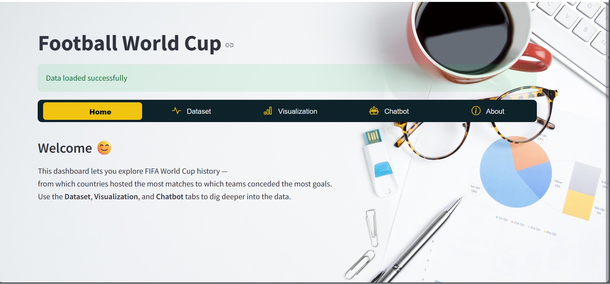
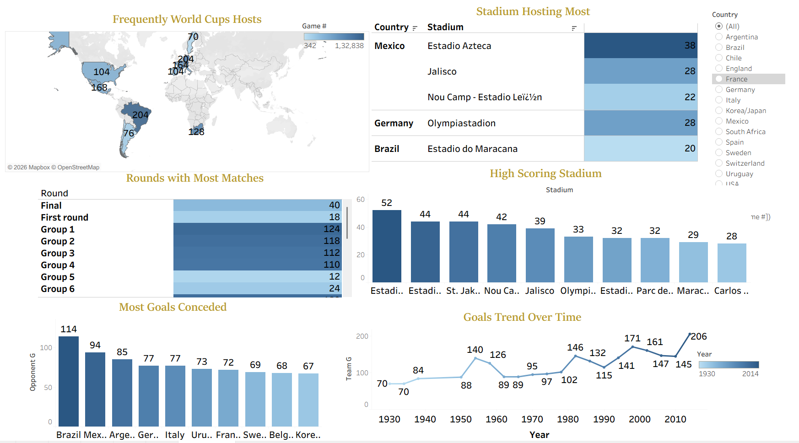

# World_Cup_Project_Documentation

## Project Summary
- Developed an interactive Football World Cup Analytics Dashboard to analyze FIFA World Cup match data (1930–2014). The application enables users to explore historical trends, hosting patterns, goal statistics, team performance, and stadium insights through dynamic visualizations and an integrated chatbot.
- The dashboard transforms raw match-level data into structured analytical insights, helping users understand tournament trends, scoring evolution, defensive performance, and match distribution across rounds.

## Dataset
- FIFA World Cup Match Results Dataset (1930–2014)
  
## Key Features
- 📊 Interactive Data Exploration
- 📈 Advanced Visual Analytics 
- 🤖 Built-in AI Chatbot
- 🎨 Professional Dashboard Design
- 📂 Multi-Platform Analysis

## 💻 Technology Stack
  Programming
 - Python
   
  Data Visualization 
 - Plotly Express: interactive charts
 - Tableau : advanced dashboard design
   
  Web Framework
 - Streamlit
   
  UI Styling
 - HTML
 - CSS

## Project Objective
- To demonstrate real-world data analytics and dashboard development skills by transforming historical football data into interactive, insightful, and visually engaging analytics.

## Disclaimer
- This project is developed for educational and analytical purposes only.
- All insights are derived from historical data and are not official FIFA statistics.

  ## Application Preview
   # Interactive Web Application (Streamlit)
   
   # Professional Business Dashboard (Tableau)
  
